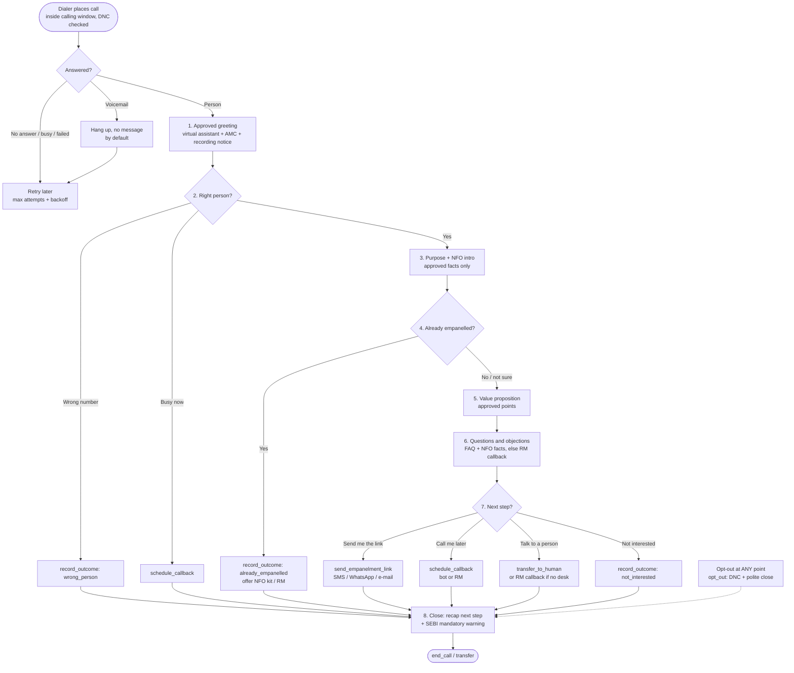

# Call flow and conversation design

How the bot runs a call: the stages, what it says, how it handles objections and edge cases,
and the actions (tools) it can take. This is the reference for Distribution and Compliance
when they review scripts, and for developers who tune the prompt.

> [!NOTE]
> The scheme, AMC and people in the examples are **fictitious**. The examples use the
> placeholder content in `config/*.yaml` (Sample Mutual Fund, Sample Flexi Cap Fund). The real
> bot says only what is in your approved YAML files.

---

## 1. Principles

1. **Disclose first.** The greeting is fixed, approved text, never generated by AI. It says the
   caller is a virtual assistant, names the AMC, announces recording and checks identity.
2. **Approved knowledge only.** Facts come from `config/amc.yaml`, `config/nfo.yaml` and
   `config/faq.yaml`. If the answer is not there, the bot does not guess. It offers an RM
   callback.
3. **Short and respectful.** Distributors are busy professionals. The bot keeps turns short (one
   or two sentences), asks one question at a time, accepts "no" the first time and never pushes.
4. **One clear next step.** Every positive call ends with a concrete action: link sent, callback
   booked or transfer to an RM.
5. **Compliant by construction.** No return promises, projections, past performance, advice,
   commission figures or inducements. Every sentence is screened before it is spoken (see
   [COMPLIANCE.md](COMPLIANCE.md)).
6. **Close with the SEBI warning.** Before the bot ends a connected call, it speaks the
   mandatory warning in the call language.

## 2. Stages

| # | Stage | Goal | What the bot does | Typical tools |
|---|---|---|---|---|
| 1 | **Greeting and disclosure** | Be transparent | Speaks the approved greeting from `amc.yaml` (no LLM): name, "virtual assistant calling on behalf of {AMC}", recording notice, "Am I speaking with {name}?" | none |
| 2 | **Identity check** | Talk to the right person | If yes, continue. Wrong person: apologise and close. Busy: offer a callback. A receptionist or family member answers: ask for a good time, leave no details. | `record_outcome`, `schedule_callback` |
| 3 | **Purpose and NFO intro** | Earn two minutes | States the purpose in one or two sentences (the NFO and partnering with the AMC), gives the NFO name, category and dates, and asks if now is a good time. | none |
| 4 | **Empanelment status** | Qualify | "Are you already empanelled with {AMC}?" Already empanelled: thank, offer the NFO kit or RM, and close. Not empanelled or unsure: continue. | `record_outcome`, `verify_arn` |
| 5 | **Value proposition** | Give a reason to partner | Up to two or three **approved** points from `distributor_value_props` and `distributor_support` (RM support, partner portal, NFO marketing kit, webinars). | none |
| 6 | **Questions and objections** | Answer honestly | Answers from FAQs and NFO facts. Anything else becomes an RM callback. See the objection table below. | `schedule_callback`, `set_language` |
| 7 | **Call to action** | Concrete next step | Offers, in order of preference: **send the empanelment link** (SMS, WhatsApp or e-mail), **book a callback** (bot or RM, inside the calling window), or **transfer to an RM now** (if an RM desk is configured). Reads back the channel and time to confirm. | `send_empanelment_link`, `schedule_callback`, `transfer_to_human`, `update_distributor_details` |
| 8 | **Close** | Leave a good impression; stay compliant | Recaps the next step, speaks the **SEBI mandatory warning**, thanks them and ends. Records the outcome, interest level and a short summary for the RM. | `record_outcome`, `end_call` |

At **any** stage, a request not to be called again triggers an immediate, polite opt-out (`opt_out`)
and the close.

## 3. Flowchart

## 4. Sample dialogues

Both dialogues are illustrative. Real wording varies, because Claude phrases the replies, but
the facts, disclosures and closing warning must stay the same. Tool calls are shown in
*[italics]* and are not spoken.

### 4.1 English: interested, asks about commission and returns, wants the link on WhatsApp

> **Bot:** Hello! This is Asha, a virtual assistant calling on behalf of Sample Mutual Fund.
> This call may be recorded for quality and compliance purposes. Am I speaking with Ravi Kumar?
>
> **Distributor:** Yes, speaking.
>
> **Bot:** Thank you, Mr Kumar. I'm calling about our upcoming NFO, the Sample Flexi Cap Fund,
> and to see if you'd like to partner with us. Do you have two minutes?
>
> **Distributor:** OK, go ahead.
>
> **Bot:** It's an open-ended dynamic equity scheme that invests across large, mid and small cap
> stocks. The NFO opens on 20 October and closes on 3 November. May I ask, are you already
> empanelled with Sample Mutual Fund?
>
> **Distributor:** No, not yet.
>
> **Bot:** Our partners get a dedicated relationship manager for their region, a digital partner
> portal with brokerage statements, and an NFO marketing kit with investor-ready material. Shall
> I send you the empanelment link?
>
> **Distributor:** What's the commission on this one?
>
> **Bot:** The brokerage structure for this scheme will be shared with you in writing by our
> relationship manager after empanelment. As per SEBI rules, there is no upfront commission and
> all brokerage is trail based.
>
> **Distributor:** Hmm. And what returns can my clients expect?
>
> **Bot:** Since it's a new fund, it has no performance history, and returns are not guaranteed.
> It's a market-linked equity scheme with a Very High risk level on the riskometer. The scheme
> information document on our website has the full details.
>
> **Distributor:** Fine. Send me the link on WhatsApp.
>
> *[send_empanelment_link: channel = whatsapp]*
>
> **Bot:** Done. I've sent the link to your mobile number on WhatsApp. The form lists the
> documents you'll need, and our team usually completes verification within a few working days.
> Anything else I can help with?
>
> **Distributor:** No, that's all.
>
> *[record_outcome: link_sent, interest = warm, summary = "Not empanelled; asked commission and
> returns; link sent on WhatsApp."]*
>
> **Bot:** Thank you for your time, Mr Kumar. Mutual Fund investments are subject to market
> risks, read all scheme related documents carefully. Have a good day!
>
> *[end_call]*

### 4.2 Hindi: asks "are you a robot?", asks about guaranteed returns, wants an SMS link and an RM call

> **बॉट:** नमस्ते! मैं आशा, सैंपल म्यूचुअल फंड की ओर से एक वर्चुअल असिस्टेंट बोल रही हूँ।
> यह कॉल गुणवत्ता और अनुपालन के लिए रिकॉर्ड की जा सकती है। क्या मेरी बात सुनीता शर्मा जी से हो रही है?
>
> **डिस्ट्रीब्यूटर:** हाँ, मैं ही बोल रही हूँ।
>
> **बॉट:** धन्यवाद, सुनीता जी। मैं हमारे आने वाले NFO, सैंपल फ्लेक्सी कैप फंड, के बारे में बताने
> और आपको हमारे साथ पार्टनर के रूप में जोड़ने के लिए कॉल कर रही हूँ। क्या आपके पास दो मिनट हैं?
>
> **डिस्ट्रीब्यूटर:** आप कोई रोबोट हो क्या?
>
> **बॉट:** जी हाँ, मैं एक AI वर्चुअल असिस्टेंट हूँ। आप चाहें तो मैं हमारे रिलेशनशिप मैनेजर से
> आपकी बात करवा सकती हूँ।
>
> **डिस्ट्रीब्यूटर:** नहीं, ठीक है, बताइए।
>
> **बॉट:** यह एक ओपन-एंडेड डायनामिक इक्विटी स्कीम है, जो लार्ज कैप, मिड कैप और स्मॉल कैप
> शेयरों में निवेश करती है। NFO 20 अक्टूबर को खुलेगा और 3 नवंबर को बंद होगा। क्या आप पहले से
> सैंपल म्यूचुअल फंड के साथ एम्पैनल्ड हैं?
>
> **डिस्ट्रीब्यूटर:** नहीं। इसमें रिटर्न कितना मिलेगा? गारंटी है?
>
> **बॉट:** नई स्कीम होने के कारण इसका कोई पिछला प्रदर्शन नहीं है, और रिटर्न की कोई गारंटी नहीं
> है। यह बाज़ार से जुड़ी इक्विटी स्कीम है और रिस्कोमीटर पर इसका जोखिम स्तर "बहुत अधिक" है।
> पूरी जानकारी स्कीम इन्फॉर्मेशन डॉक्यूमेंट में दी गई है।
>
> **डिस्ट्रीब्यूटर:** ठीक है। एम्पैनलमेंट के लिए क्या करना होगा?
>
> **बॉट:** हम आपको एक लिंक भेजेंगे। उसमें ऑनलाइन फॉर्म भरकर ज़रूरी दस्तावेज़ अपलोड करने होंगे,
> जिनकी सूची फॉर्म में दी गई है। हमारी टीम आम तौर पर कुछ कार्यदिवसों में वेरिफिकेशन पूरा कर देती
> है। लिंक SMS पर भेज दूँ?
>
> **डिस्ट्रीब्यूटर:** हाँ, SMS पर भेज दीजिए। और मेरे इलाके के RM से भी बात करवा दीजिए।
>
> **बॉट:** ज़रूर। RM आपको किस दिन और किस समय कॉल करें?
>
> **डिस्ट्रीब्यूटर:** कल सुबह ग्यारह बजे।
>
> *[send_empanelment_link: channel = sms] [schedule_callback: कल 11:00 IST, with_rm = true]*
>
> **बॉट:** मैंने लिंक आपके मोबाइल नंबर पर SMS से भेज दिया है, और कल सुबह ग्यारह बजे हमारे
> रिलेशनशिप मैनेजर की कॉल तय कर दी है।
>
> *[record_outcome: link_sent, interest = hot, summary = "AI पूछा; गारंटी पूछी; SMS लिंक भेजा; RM कॉल कल 11 बजे।"]*
>
> **बॉट:** आपके समय के लिए धन्यवाद, सुनीता जी। म्यूचुअल फंड निवेश बाज़ार जोखिमों के अधीन हैं,
> योजना संबंधी सभी दस्तावेज़ ध्यान से पढ़ें। आपका दिन शुभ हो!
>
> *[end_call]*

## 5. Objection handling

| Distributor says | What the bot does | Tool / outcome |
|---|---|---|
| **"I'm busy."** | Apologises and asks for a convenient day and time, offering times inside the calling window. Confirms the time back. | `schedule_callback` (bot re-call or RM). Outcome `callback_requested`. |
| **"Not interested."** | Accepts it the first time. It may offer once to send the link for later, but never argues or repeats the pitch. Thanks them and closes with the warning. | `record_outcome: not_interested`. No further calls in this campaign. |
| **"I'm already empanelled with you."** | Thanks them (approved FAQ answer). Offers the NFO marketing kit or the RM's contact. | `record_outcome: already_empanelled`. Never dialled again automatically. |
| **"What's the commission / brokerage?"** | Speaks the approved `commission_response`: in writing from the RM after empanelment; no upfront commission; trail based. **Never a number**, never a comparison with other AMCs. | None (the screen blocks any figure). |
| **"Send me details on WhatsApp."** | Sends the empanelment link on WhatsApp (an approved template). Shares only approved content. If WhatsApp is not set up, the message is queued in the outbox for the team. | `send_empanelment_link: whatsapp`. Outcome `link_sent`. |
| **"I'm an RIA, not a distributor."** | Thanks them and uses the approved RIA answer. No commission or distribution pitch. Arranges for the right AMC team to contact them. | `schedule_callback` (RM), summary notes "RIA". |
| **"Wrong number."** | Apologises for the disturbance and ends. Does not ask who the right person is or collect anyone else's details. | `record_outcome: wrong_person`. Number not dialled again automatically. |
| **"Don't call me again."** / **"मुझे दोबारा कॉल मत करना"** | Confirms immediately and politely, without trying to change their mind, and closes. | `opt_out`. Added to the DNC list and never called again. |
| **"Are you a robot?"** | Says truthfully that it is an AI virtual assistant calling on behalf of the AMC. Offers a human RM. | `transfer_to_human` or `schedule_callback` if they want a person. |
| **"What returns will it give? What was the performance?"** | No numbers and no projections. It is a new fund with no performance history; returns are not guaranteed; it states the riskometer level; points to the SID/KIM. Does not quote other schemes' or index returns. | None (the screen blocks projections and past-performance claims). |
| **"How is it better than fund X / AMC Y?"** | Does not compare with or disparage other funds or AMCs. Restates approved facts about this scheme and offers an RM for a detailed discussion. | `schedule_callback` (RM) if they want more. |
| **"How did you get my number?"** | Approved FAQ answer: listed as an AMFI-registered distributor. Offers removal right away. | `opt_out` if they want removal. |
| **"Is there any fee?" / "How long does it take?"** | Approved FAQ answers. | None. |
| **Asks for advice** ("Which fund should my client buy?") | Explains that it cannot give investment advice. Offers approved scheme facts and the SID/KIM, or an RM. | None, or `schedule_callback`. |
| **Offers an incentive deal** ("What extra will you give me?") | No inducements of any kind. Speaks only the approved support points (RM, kit, webinars). | None (the screen blocks inducement language). |

## 6. Edge cases

| Situation | Behaviour |
|---|---|
| **Silence / no reply** | Deterministic re-prompt with no LLM call ("Sorry, I didn't catch that..."), up to `NO_INPUT_REPROMPTS` times (default 1), then a polite goodbye and hang-up. Counted as an attempt; the outcome stays `no_outcome`. |
| **Voicemail / answering machine** | With answering-machine detection (Twilio), the bot hangs up without speaking by default (`leave_voicemail: false` in `campaign.yaml`). If voicemail is enabled, it plays only the approved `voicemail_message`, which should contain no personal data and no scheme claims. The contact is retried according to the backoff. |
| **Language switch** | If the distributor speaks or asks for Hindi (or any enabled language), the bot calls `set_language`, and speech synthesis and recognition switch for the rest of the call. The closing warning uses that language's approved translation. A language that is not enabled is politely declined and offered by RM callback. |
| **Abuse or hostility** | Stays calm and polite, never argues or retaliates. Offers to stop calling. If the abuse continues, closes the call. Records `not_interested`, or `opted_out` if they asked not to be called. |
| **Poor audio / misrecognition** | Asks once to repeat. Reads back important details (callback time, e-mail) before acting. If the line stays poor, offers a callback and closes. |
| **Third party answers** (assistant, family) | Does not discuss the NFO or the distributor's details. Asks for a good time to reach the distributor, or closes politely. |
| **Distributor starts reading out PAN, bank or Aadhaar details** | Interrupts politely: these are never collected on the call; documents go only through the secure empanelment form. |
| **Question outside the approved knowledge** | Says it does not have that information and offers an RM callback. Never guesses. |
| **Long call** | At `MAX_CALL_TURNS` (24) or `MAX_CALL_SECONDS` (420 s), the bot is told to wrap up. If it does not, the call is closed (with the warning). |
| **The AI service fails or times out** | The bot apologises, an RM callback is created automatically, and the call ends. The error is recorded on the call and in the audit log. |
| **Unsafe reply blocked by the screen** | The planned sentence is replaced with a safe line ("I can only share information from the official scheme documents..."), the turn is flagged for review, and the model is told its reply was not spoken. |
| **Callback requested outside calling hours** | The bot offers the nearest time inside the window (for example, "Saturday 10 am"). |

## 7. Tools the bot can use

Claude calls these during the conversation. The server carries them out, using the database for
anything personal, and returns the result to the model. Tool names are fixed (see
[ARCHITECTURE.md](ARCHITECTURE.md) section 4.4).

| Tool | What it does | Side effects |
|---|---|---|
| `verify_arn` | Checks the ARN the distributor states against our record (canonical `ARN-<digits>` form). | None. |
| `update_distributor_details` | Corrects details the distributor gives, such as e-mail or preferred language. | Updates the distributor record. |
| `send_empanelment_link` | Sends a tracked empanelment link (`/r/<token>`) by SMS, WhatsApp or e-mail to the contact on file. | Outbox row, audit `link_sent`, funnel status `link_sent`. |
| `schedule_callback` | Books a callback, by the bot or a human RM, at a time inside the calling window. | Callback row, audit `callback_scheduled`, status `callback_scheduled`. |
| `set_language` | Switches the call language (TTS and STT) to an enabled language. | Call language updated. |
| `transfer_to_human` | Warm transfer to the RM desk (`RM_TRANSFER_NUMBER`). | Audit `transfer`, outcome `transferred`. |
| `opt_out` | Records a do-not-call request. | DNC entry, status `do_not_call`, audit `opt_out` / `dnc_added`. |
| `record_outcome` | Sets the call disposition, interest level (hot, warm or cold) and a summary for the RM. | Call outcome, which drives the funnel status. |
| `end_call` | Ends the call after the current reply (and the closing warning). | Hang-up. |
